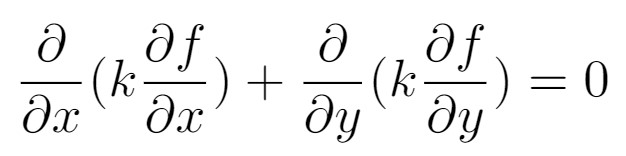
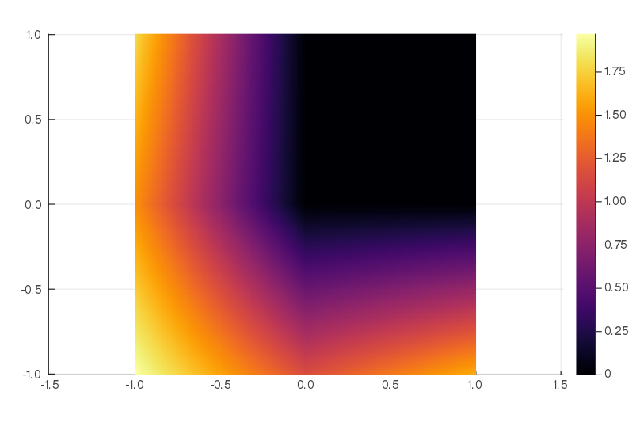

## Problem description

This solution focuses on solving heat transfer equation
  

The image bellow shows heat-map generated based on found function.

*This code can be easily changed to suit many more examples.*

## Used modules:
* [PolygonOps](https://github.com/JuliaGeometry/PolygonOps.jl)  
Used for **point in concave polygon detection** while building mesh.
* [ForwardDiff](https://github.com/JuliaDiff/ForwardDiff.jl)  
Used for **AD** in order to increase precision of derivative based calculations.
* [Cubature](https://github.com/stevengj/Cubature.jl)  
Used for **multi-dimensional adaptive integration**
* [Plots](https://github.com/JuliaPlots/Plots.jl)  
Used for **plotting heat-map**

## Used algorithms:
*

## Running the program for the first time
You have to install all required dependencies.
open `julia` and type  
`] activate .`  
`] instantiate`  
